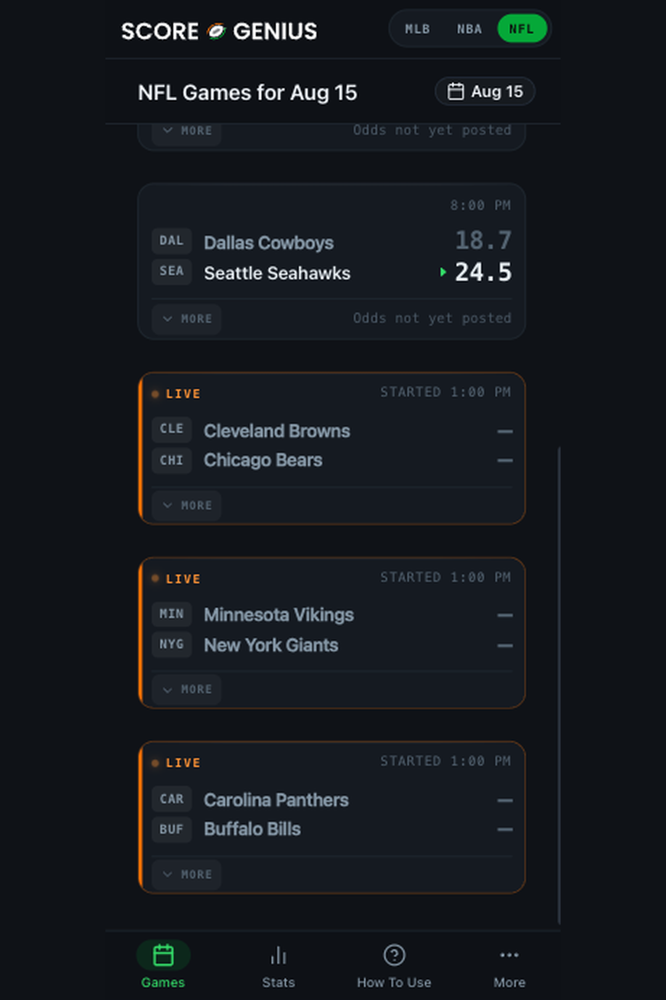
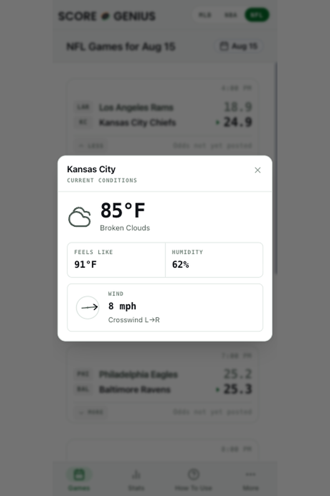
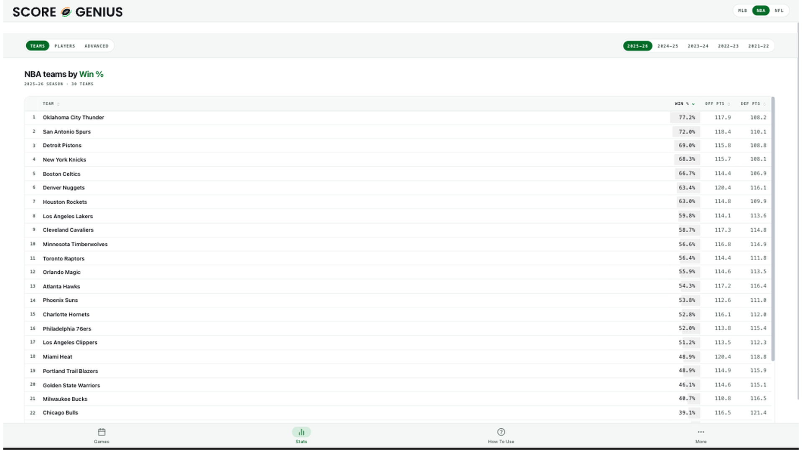

# ScoreGenius

**Sports analytics PWA for NFL, NBA and MLB. Model score predictions, compared against the betting
market.**

[scoregenius.io](https://scoregenius.io) · [Google Play](https://play.google.com/store/apps/details?id=io.scoregenius.app) · [Microsoft Store](https://apps.microsoft.com/detail/9P843BS4GCGP)

---

ScoreGenius predicts game outcomes and compares those predictions against betting markets. The
interface exists to answer one question quickly: **which of today's games are worth a closer look?**

A user opens the app, sees twelve to fifteen games, and can flick through and stop at the two or
three that matter — without reading every number on every card.

<p align="center">
  
  
</p>

<p align="center">
  
</p>

<p align="center"><em>More in <a href="docs/screenshots/">docs/screenshots</a> — both themes, all three leagues, mobile and desktop.</em></p>

## What it does

- Ingests schedules, box scores, team and player stats, injuries, venue weather and betting odds
  across three leagues
- Computes rolling form, rest and schedule context, matchup features and advanced metrics
- Produces score and margin predictions from regression-based model ensembles
- Compares each prediction against the posted market and tiers the disagreement as an **edge**
- Emits per-game snapshots so the interface renders without recomputing anything
- Serves it through an API to an installable, offline-capable Progressive Web App

## What it deliberately does not do

Stated up front because a sports app trains people to expect otherwise, and because the interface is
designed around these limits rather than in spite of them:

- **No live scores, innings, quarters or clock.** A game is scheduled, in progress, or final.
- **Predictions are pre-game.** Once a game starts, the predicted scores clear.
- **The edge is a comparison, not a probability.** It measures disagreement between the model and
  the market. It is not a confidence the product will stand behind, and calibrated probabilities are
  never surfaced.

## About this repository

This is the **frontend**: the React PWA that ships to the Play Store and the web.

The data pipeline, feature engineering, model training and the trained models are not here. They are
part of the asset and are held in a private repository, available under a signed agreement.

```
frontend/src/components/    the card, chrome, modals, charts, shared UI
frontend/src/screens/       Games, Stats, How to Use, More, game detail
frontend/src/utils/         pure helpers, unit-tested with no framework
frontend/src/index.css      design tokens for both themes, plus component blocks
docs/design_system.md       the system this interface is built on
docs/handover/              two documents written for readers evaluating the product
```

## The interface

The app was rebuilt against a written design system rather than by eye. `docs/design_system.md`
carries it: the token palette with **measured** contrast ratios for both themes, the component
library, the patterns each screen is built from, an accessibility target of WCAG 2.1 AA, and a
defect register.

Two things in there are worth a moment if you are evaluating this codebase:

- **§4, "What the app actually knows".** The constraints above, written down, so that no screen ends
  up implying a data feed that does not exist.
- **The defect register.** Every defect found during the rebuild, what it measured, and what closed
  it. Sixty-five of seventy-four are closed. The open ones are listed with their reasons.

`docs/handover/` holds two longer documents — one on what changed in the interface and why, one on
the design system itself. Every interface specimen in them is rendered live from the design system's
own token values rather than screenshotted, so they stay accurate if the tokens change.

## Tech stack

| Layer | Choice |
|---|---|
| UI | React 18, TypeScript, Vite 6 |
| Styling | Tailwind, over CSS custom properties defined per theme |
| Data | TanStack Query |
| Charts | Recharts |
| Routing | React Router |
| Packaging | Installable PWA; Android ships as a Trusted Web Activity |
| Tests | Node's built-in runner over pure modules, zero test dependencies |

## Running it

Node 22 or newer.

```bash
cd frontend
npm install
npm run dev
```

The dev server proxies `/api` to production, so it comes up with **real games and real predictions**
without a backend to stand up. It is the same API the published app calls.

```bash
npm run check     # lint, unit tests, production build
```

## Distribution

Three platforms, one codebase:

| Channel | |
|---|---|
| **Google Play** | [`io.scoregenius.app`](https://play.google.com/store/apps/details?id=io.scoregenius.app) — Trusted Web Activity, Play App Signing |
| **Microsoft Store** | [`9P843BS4GCGP`](https://apps.microsoft.com/detail/9P843BS4GCGP) — MSIX, Store-delivered updates |
| **Web** | Installable PWA at [scoregenius.io](https://scoregenius.io) |

The Android and Windows apps both wrap the same PWA rather than reimplementing it, so **a web deploy
updates every channel at once** — no store review, no version bump, no per-platform release. One
frontend commit reaches every platform, which is the practical reason this repository is the whole
client story.

Digital Asset Links at `/.well-known/assetlinks.json` bind the Android package to the domain.

## License

**Proprietary. All rights reserved.** See [LICENSE](./LICENSE).

This repository is published for evaluation. It is not open source, and no licence to use, copy,
modify or distribute is granted by its being visible here.

## Contact

[hello@scoregenius.io](mailto:hello@scoregenius.io)
